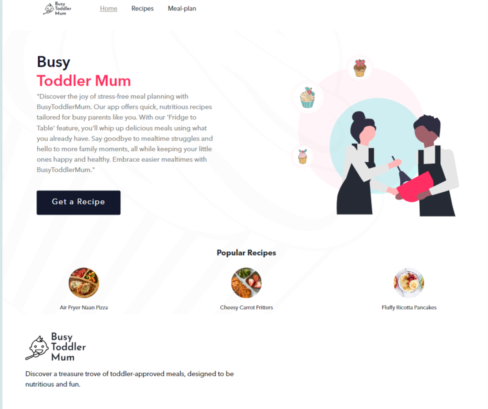
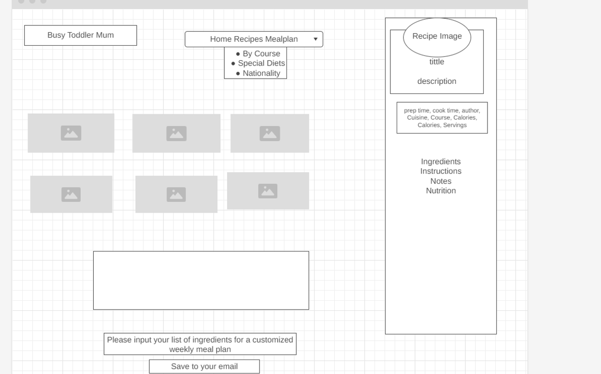

# BusyToddlerMum


A capstone project from [BrainStation's](https://brainstation.io/) Software Engineering April 2024 bootcamp cohort. The backend server can be found [here](https://github.com/erioluwa66/BusyToddlerMumApi).


## APP Preview


## Overview
BusyToddlerMum is a comprehensive solution for parents seeking to simplify and enrich the meal planning process for their toddlers. This platform serves as a culinary companion, helping to foster healthy eating habits with a user-friendly interface.


### Problem

Parents often face the challenge of finding the time to plan, prepare, and diversify meals for their toddlers. BusyToddlerMum addresses this by providing easy-to-follow recipes, meal scaling for various serving sizes, and a platform to manage weekly meal plans effectively

### User Profile
BusyToddlerMum is designed for the proactive parent who values nutritious meals and seeks convenience in meal planning. The platform is also an excellent resource for caretakers or educators who wish to explore a variety of meal options for children.

### Features
- **Recipe Discovery**: Search for toddler-approved recipes using the filter function to check by course or cuisine.
- **Meal Planning**: Easily plan your week with customized meal schedules using Openai chat assitance.
- **Nutritional Insights**: Access detailed nutritional information for each recipe to ensure a balanced diet for your toddler.


Shopping Requirements/Pantry Organizer: Users can track their pantry inventory and generate shopping lists based on meal plans and current pantry stock.

## Implementation

### Tech Stack
- React.js
- Express.js
  - Knex
  - cors
- Node.js
- MySQL

### APIs

OpenAi API

## Docker Container Setup

### Deployment
This frontend is containerized and ready for deployment using Docker. It is automatically built and pushed to AWS ECR using GitHub Actions.


### Building and Running with Docker

1. **Build the Docker image:**
   `    docker build -t busytoddlermumclient .
   `
    <br>
2. **Ensure Docker Desktop is running and then execute:**
  
    <br>
     `    docker run -p 80:80 busytoddlermumfrontend
   `
    <br>
### Continuous Integration and Deployment
- The GitHub Actions workflow automates the testing, building, and deployment to AWS ECR. The ECR image can be deployed to a service like AWS ECS for production environments.


### Sitemap

Home: Overview 
Custom Recipes
Meal Planner: Create and manage meal plans

### Mockups




### Data


### Endpoints
This app's API server has the following list of endpoints:

- `GET /api/recipes`: Retrieve all recipes
- `GET /api/recipes/:id`: Retrieve a recipe by ID
- `POST /api/meal-plan`: Retrieve a week mealprep

- RESPONSES: 
  - 200 success for all GET  requests
  - 201 created new content for POST requests
  - 404 not found
  - 401 unauthorized; display if user tries to access user page without logging in
  - 400 bad request
  - 500 internal server error

### Auth

The authentication mechanism for the application is yet to be decided. Options include traditional username/password authentication, social media login integration, or JWT-based authentication.

## Roadmap

Sprint 1
Set up basic project structure (frontend and backend)
Create database schema
Implement basic CRUD operations for recipes and meal plans

Sprint 2
Integrate openAI API for providing meal suggestions and nutritional insights
Develop frontend components for recipe and meal planning.

## Nice-to-haves

Authentication: Implement robust user authentication mechanisms to ensure data security.
Integration with External Services: Integrate with Instacart or similar services for seamless shopping experience.
Enhanced Meal Planning Features: Implement features like recipe suggestions, meal prep tips, and nutritional tracking for advanced meal planning capabilities.
Pantry Restock: Manage pantry inventory and generate shopping lists
Favorites: Save favorite recipes
Profile: User settings and preferences

## Setup
Requirements for before running the client side application:
1) Follow the instructions to setup the [backend API server](https://github.com/erioluwa66/BusyToddlerMumApi).

2) Install nodeJS dependencies
    ```
    npm install
    ```
3) Create a .env file with variables from the sample file .env.sample

4) Start the react App
    ```
    npm start
    ```
